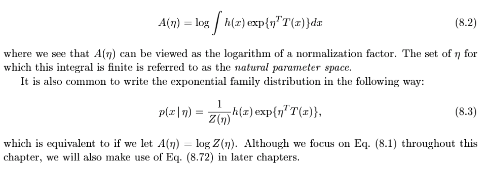
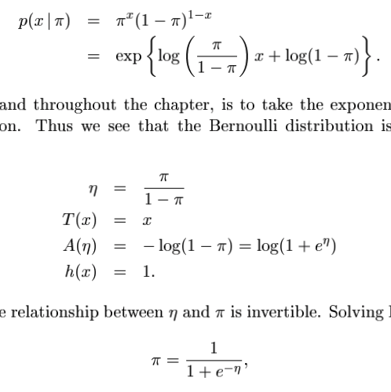
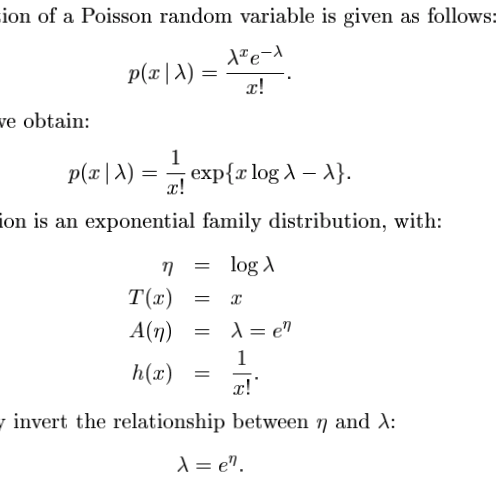
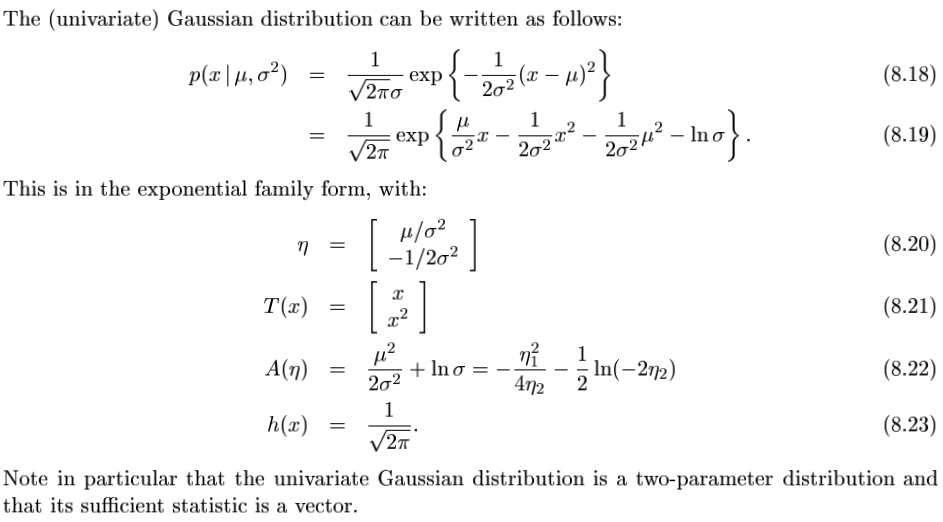
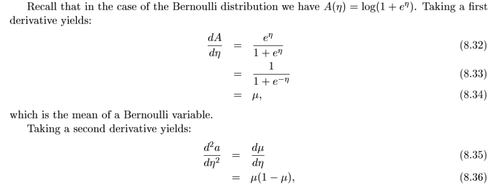
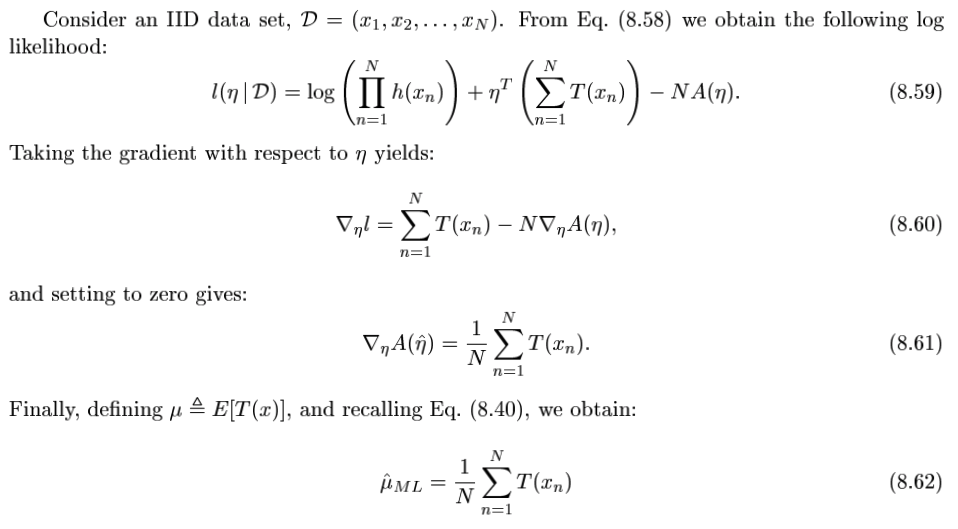
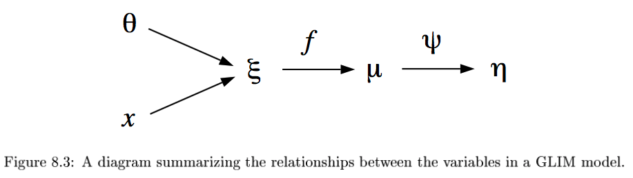

The exponential family and generalized linear models
===

##### Yimeng Zhang

##### 2017/03/29

mostly based on Chapter 8 of "*An introduction to probabilistic graphical models*" by Michael I. Jordan, later referred to as "**the book**"

---

# Contents

- Exponential family
	- Examples
	- Properties
	- ML estimation
- Generalized linear models
	- response function

---

# Exponential family

$$ p(x\mid \eta) = h(x) \exp{\{ \eta^T T(x) - A(\eta) \}} $$

1. transform $x$ to $T(x)$, "**sufficient statistics**". $T(x)$ is a fixed function, without any parameter to fit.
2. dot product $T(x)$ with $\eta$, then take exp, thus *exponential*
3. $A(\eta)$ is just normalization. See Eq. (8.2) of the book,.
4. $h(x)$ weights different $x$. mostly used in Poisson, trivial in other distributions.

---

---

# Exp family - examples

Bernoulli distribution, pp. 4 of the book.

---

# Exp family - examples

Poisson distribution, pp. 5 of the book.

---

# Exp family - examples

Gaussian distribution, pp. 5 of the book.

I omit tricky examples. See `misc/exponential_families.ipynb` on <https://github.com/leelabcnbc/machine-learning-notes> for a more thorough treatment.

---

# Exp family - examples

My take away:

1. a distribution can be parameterized (specified) in unusual ways, not just mean and variance.
2. there is isomorphism between different parameterizations, it's hard to say which is more "correct" than the other. This ambiguity is still true, even if we parameterize in the form of exponential family. Say $T(x) = x$ or $T(x) = 2x$.
3. In some forms (say exponential), many distributions can be considered as connected ones, sharing many good properties

---

# Exp family - properties

Looks that $A$ is just some normalization factor, but it actually has everything you need about the distribution.

* $P(x \mid \eta^*)$ is scalar distribution, parameterized by a scalar $\eta$.
* the first derivative of $A(\eta)$ at $\eta^*$ gives you the **mean** of $T(x)$, second derivative gives **variance** of $T(x)$.

Example: pp. 7 of the book.

---

# Exp family - properties

This makes ML estimation of exponential family super easy.

---

# Exp family - ML estimation

Check pp. 12 of the book

Last equation is the essence of ML estimation. Compute mean of $T(x)$ from data, and find $\eta$ with matching $E[T(x)]$.

---

# Exp family - ML estimation

* In pp. 7 of the book, we know that, given $\eta$, we can compute mean of $T(x)$.
* Given mean of $T(x)$, we can also solve for the (unique) $\eta$, under certain conditions.
* That's all about ML estimation.

---

# Generalized linear models

* we use GLM to model relationship between some input $x$ and output $y$.
* $y$ is an exponential family distribution whose parameter is conditioned on $x$: $\eta(x)$.
* That's all.

